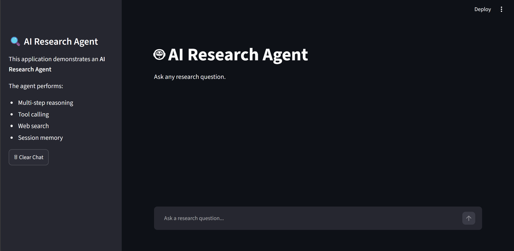
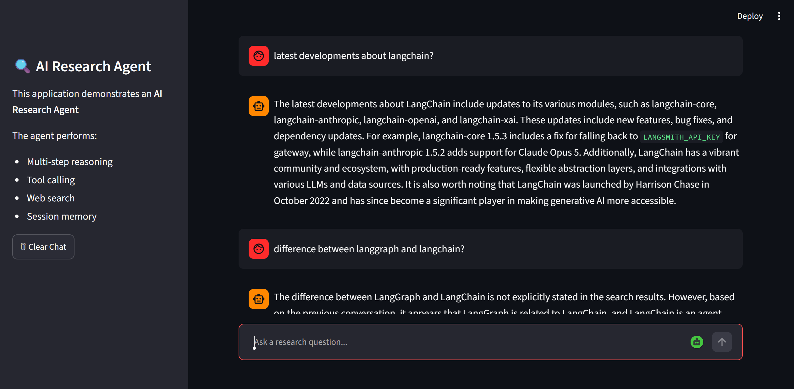

# AI Research Assistant 

An intelligent, multi-agent research assistant built using **LangGraph**, **LangChain**, **Groq (Llama 3.3)**, and the **Tavily Search API**. The application features both an interactive web-based interface built with **Streamlit** and a terminal-based command-line interface (CLI).

---

## 📋 Project Description
The AI Research Assistant is designed to perform autonomous research. By employing a graph-based state machine architecture via LangGraph, the agent dynamically decides whether it needs to search the web for real-time information or rely on its pre-trained general knowledge base to answer queries. 

The system maintains memory of the current chat session, allowing users to ask follow-up questions, request comparisons, or ask for summaries based on the gathered context.

---

## ✨ Features
- **Dynamic Request Routing:** Automatically analyzes user questions in the router node to detect if they require fresh web search results (detecting keywords like *latest, news, research, compare, find, search*).
- **Web Search Integration:** Utilizes the Tavily Search API to execute targeted web searches and retrieve context-rich results.
- **Contextual Synthesis:** A reasoning node powered by Groq's Llama 3.3 model processes search results and generates a coherent, summarized response.
- **General Knowledge Fallback:** If search is not triggered, the LLM answers directly using its native knowledge.
- **Session Memory:** Remembers preceding dialogue (User-Assistant exchanges) during the session for context-aware conversation.
- **Dual Interface Options:**
  - **Streamlit Web UI:** A modern, clean web interface featuring a sidebar, message clear utility, and real-time response generation.
  - **Terminal CLI:** A lightweight CLI for fast terminal interactions.

---

## 🛠 Technologies Used
- **Language:** [Python 3.10+](https://www.python.org/)
- **Agent Orchestration:** [LangGraph](https://github.com/langchain-ai/langgraph)
- **LLM Framework:** [LangChain](https://github.com/langchain-ai/langchain)
- **LLM Inference Provider:** [Groq Cloud API](https://console.groq.com/) (using `llama-3.3-70b-versatile`)
- **Search Engine API:** [Tavily AI Search](https://tavily.com/)
- **Web Interface:** [Streamlit](https://streamlit.io/)
- **Configuration Management:** [python-dotenv](https://github.com/theofidry/django-dotenv)

---

## 📁 Project Structure
The repository is structured logically to separate the state graph architecture, agent definition, and node execution blocks:

```text
ai_research_assistant/
├── app.py                  # Entrypoint for the Streamlit Web Application
├── cli_agent.py            # Entrypoint for the Command Line Interface (CLI)
├── requirements.txt        # Python dependency configuration
├── .env.example            # Template for environment configuration
├── README.md               # Project documentation (this file)
│
├── agents/
│   └── research_agent.py   # Core ResearchAgent wrapper class
│
├── graph/
│   ├── graph_builder.py    # LangGraph state machine node/edge construction
│   └── state.py            # State definition (ResearchState TypedDict)
│
├── nodes/
│   ├── memory_node.py      # Appends chat context to state history
│   ├── reasoning_node.py   # Uses LLM to synthesize answer (based on search/general info)
│   ├── router_node.py      # Determines if route goes to search or reasoning directly
│   └── search_node.py      # Connects to search_tool to fetch web results
│
├── tools/
│   └── search_tool.py      # Initializes TavilySearchResults tool instance
│
├── utils/
│   └── llm.py              # Initializes ChatGroq LLM instance
│
└── assets/
    └── screenshots/
        ├── home.png        # Welcome screen of Streamlit App
        └── sample.png      # Search agent running query screen
```

---

## 📥 Installation Instructions
Follow these steps to set up the repository locally:

### 1. Clone the Repository
```bash
git clone https://github.com/Samyuktha13-06/Dstarix_week4_ai_research_agent.git
cd ai_research_assistant
```

### 2. Set Up a Virtual Environment
It is highly recommended to isolate dependencies inside a virtual environment.

**On Windows:**
```bash
python -m venv venv
.\venv\Scripts\activate
```

**On macOS / Linux:**
```bash
python3 -m venv venv
source venv/bin/activate
```

### 3. Install Dependencies
```bash
pip install -r requirements.txt
```

---

## ⚙️ Setup Instructions
The application requires API keys from Groq and Tavily.

1. **Copy the environment template:**
   ```bash
   cp .env.example .env
   ```
2. **Configure your API keys:**
   Open the newly created `.env` file and insert your API keys:
   ```env
   GROQ_API_KEY=your_groq_api_here
   TAVILY_API_KEY=your_tavily_api_key_here
   ```
   - Get a free Groq API Key from the [Groq Console](https://console.groq.com/).
   - Get a free Tavily API Key from [Tavily AI](https://tavily.com/).

---

## 🚀 Usage Guide

### Option 1: Streamlit Web UI (Recommended)
Launch the Streamlit web dashboard to interact visually with the research agent.

```bash
streamlit run app.py
```

> [!NOTE]
> **Windows Security Warning:** If you encounter the following error:
> `Program 'streamlit.exe' failed to run: An Application Control policy has blocked this file`
> Run Streamlit directly using the Python interpreter:
> ```bash
> python -m streamlit run app.py
> ```

Once running, open your web browser to `http://localhost:8501`.

### Option 2: Terminal CLI
For a faster, terminal-based query loop, run the interactive CLI script:

```bash
python cli_agent.py
```
- Type your search/general question at the `You:` prompt and press **Enter**.
- Type `exit` or `quit` to exit the CLI application.

---

## 📸 Screenshots

Here is what the application looks like in action:

### Home View


### Search Query Execution

